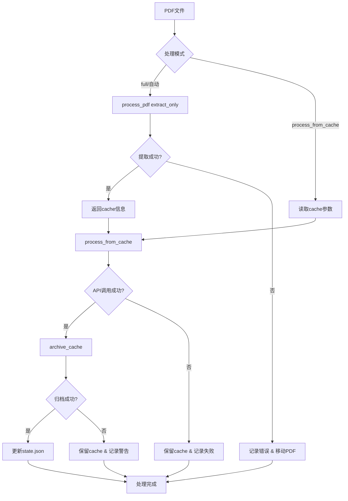

# 设计文档: PDF缓存处理优化

## 概述

本设计通过引入缓存机制将PDF处理流程拆分为两阶段（图片提取 + API调用），提升系统可靠性并优化日志输出。核心原则是**最小化新增代码，最大化复用现有函数**，保持向后兼容性。

关键改进：
- 将 `process_pdf` 改造为支持双模式（完整模式/仅提取模式）
- 新增 `process_from_cache` 从缓存读取图片并调用API
- 新增 `archive_cache` 自动归档提取的图片
- 优化API调用日志，移除base64编码内容
- 支持独立执行第二阶段（失败重试）

## 技术栈与架构对齐

### 技术栈延续
- **Python 3.12+** - 保持现有版本
- **OpenAI API** - 通过 OpenAI 客户端调用 Gemini 3 Flash
- **pdf2image** - PDF转图片（已在使用）
- **Pillow (PIL)** - 图片处理（已在使用）
- **Pandas** - 数据处理（已在使用）

### 架构原则
1. **单一职责**：每个函数职责清晰
   - `process_pdf`: 负责PDF到图片的提取
   - `process_from_cache`: 负责从缓存调用API
   - `archive_cache`: 负责cache归档

2. **模块化设计**：缓存逻辑与PDF处理逻辑解耦
3. **配置驱动**：所有参数通过 config.json 配置
4. **最小侵入**：不破坏现有主流程，新增模式参数

## 代码复用分析

### 现有组件复用

1. **encode_images_to_base64** (processing.py)
   - 复用：在 `process_from_cache` 中编码图片
   - 无需修改：已支持JPEG格式和质量参数

2. **build_vision_payload** (processing.py)
   - 复用：构建API请求payload
   - 无需修改：通用函数

3. **call_vision_api** (processing.py)
   - 复用：实际API调用
   - 需要修改：优化日志输出（需求1）

4. **convert_pdf_to_images** (processing.py)
   - 复用：PDF转图片逻辑
   - 无需修改：已支持DPI和格式参数

5. **get_page_count** (processing.py)
   - 复用：统计PDF页数
   - 无需修改：简单功能函数

6. **批次管理 (state.json)**
   - 复用：现有的批次号管理
   - 需要增强：添加cache归档记录

### 需要删除的过时组件
1. **get_smart_pages_to_process** (processing.py)
   - 删除：智能选页逻辑已被简化

2. **页面筛选配置** (config.json)
   - 删除：page_filtering 配置块

## 架构设计

### 处理流程图



### 核心组件设计

#### 1. 改造后的 `process_pdf` 函数

**位置**: `/home/thelya/Work/data/processing.py`

```python
def process_pdf(
    pdf_path: str,
    client,
    config: Dict[str, Any],
    system_prompt: str,
    mode: str = "full"
) -> Optional[Dict[str, Any]]:
    """
    PDF处理主函数，支持双模式

    Args:
        pdf_path: PDF文件路径
        client: OpenAI客户端
        config: 配置字典
        system_prompt: 系统提示词
        mode: 处理模式
            - "full": 完整处理（向后兼容）
            - "extract_only": 仅提取图片到cache

    Returns:
        mode="extract_only": {"cache_dir": str, "image_paths": List[str]}
        mode="full": {"result": Dict, "cache_dir": str}
        失败: None
    """
```

**关键改动**:
- 新增 `mode` 参数（默认"full"保持向后兼容）
- 统一返回字典格式（不再是元组）
- 内部实现分两阶段：提取图片 → 调用API
- 自动保存图片到 `./cache/{pdf_name}/`
- 支持配置最大页数限制（`max_pages`）

**页数处理逻辑**:
```python
max_pages = config.get('processing_settings', {}).get('max_pages', 25)
page_count = get_page_count(pdf_path)

if page_count > max_pages:
    logger.warning(f"PDF页数({page_count})超过最大限制({max_pages})，只处理前{max_pages}页")
    pages_to_process = list(range(1, max_pages + 1))
else:
    # 原逻辑：处理除最后一页外的所有页
    if page_count > 1:
        pages_to_process = list(range(1, page_count))
    else:
        pages_to_process = [1]
```

#### 2. 新增的 `process_from_cache` 函数

**位置**: `/home/thelya/Work/data/processing.py`

```python
def process_from_cache(
    cache_dir: str,
    pdf_name: str,
    image_paths: List[str],
    client,
    config: Dict[str, Any],
    system_prompt: str
) -> Optional[Dict[str, Any]]:
    """
    第二阶段：从cache读取图片并调用API

    Args:
        cache_dir: cache目录路径（用于日志）
        pdf_name: PDF文件名（用于归档）
        image_paths: 图片文件路径列表
        client: OpenAI客户端
        config: 配置字典
        system_prompt: 系统提示词

    Returns:
        提取的数据字典
    """
```

**关键实现**:
- 从指定路径读取图片文件
- 复用 `encode_images_to_base64` 进行编码
- 复用 `build_vision_payload` 构建请求
- 复用 `call_vision_api` 调用API
- 失败时返回None并记录详细错误

#### 3. 新增的 `archive_cache` 函数

**位置**: `/home/thelya/Work/data/processing.py` 或 `main.py`

```python
def archive_cache(
    cache_dir: str,
    pdf_name: str,
    batch_number: int,
    archive_base: str
) -> Optional[str]:
    """
    将cache目录归档到指定位置

    Args:
        cache_dir: cache目录路径
        pdf_name: PDF文件名（用于命名zip文件）
        batch_number: 批次号
        archive_base: 归档根目录

    Returns:
        归档文件路径（成功）或 None（失败）
    """
```

**关键实现**:
- 时间戳格式化：`YYYY-MM-DD`
- 批次目录：`Dataset ({batch_number}) {date}/`
- Zip文件名：`{pdf_name}_images.zip`
- 异常处理：zip创建失败、rmtree失败
- 失败时保留cache目录

**归档路径示例**:
```
/mnt/e/Documents/data_extracted/Dataset (15) 2025-03-25/
├── paper1_images.zip
├── paper2_images.zip
└── ...
```

#### 4. 优化的 `call_vision_api` 函数

**位置**: `/home/thelya/Work/data/processing.py`（已有函数修改）

**日志优化前**:
```python
logger.debug(f"请求payload: {payload}")  # 包含base64编码，日志巨大
logger.debug(f"完整响应内容: {content}")  # 响应内容可能很大
```

**优化后**:
```python
# 第963行（大约）
image_count = len([item for item in payload["messages"][1]["content"] if item["type"] == "image_url"])
logger.debug(f"API请求 - 模型: {model_name}, 图片: {image_count}, max_tokens: {max_tokens}")

# 第975行（大约）
logger.debug(f"API响应长度: {len(content)} 字符")
if len(content) > 1000:
    logger.debug(f"响应预览: {content[:500]}...")
else:
    logger.debug(f"完整响应内容: {content}")
```

#### 5. 主流程更新 (`main.py`)

**位置**: `/home/thelya/Work/data/main.py`

**自动流程**（处理新PDF）:
```python
# 阶段1: 提取图片
cache_result = process_pdf(file_path, client, config, SYSTEM_PROMPT, mode="extract_only")

if cache_result:
    cache_info = cache_result
    cache_dir = cache_info["cache_dir"]
    image_paths = cache_info["image_paths"]
    pdf_name = os.path.splitext(os.path.basename(file_path))[0]

    # 阶段2: 调用API
    result = process_from_cache(cache_dir, pdf_name, image_paths, client, config, SYSTEM_PROMPT)

    if result:
        # 阶段3: 归档
        archive_path = archive_cache(cache_dir, pdf_name, state["batch_number"],
                                   config["paths"]["archive_destination"])
        if archive_path:
            logger.info(f"归档成功: {archive_path}")
        else:
            logger.warning(f"归档失败，保留cache: {cache_dir}")
    else:
        logger.error(f"API处理失败: {pdf_name}")
        # 失败处理（移动PDF到NotInput）
else:
    logger.error(f"图片提取失败: {file_path}")
    # 失败处理（移动PDF到NotInput）
```

**独立第二阶段流程**:
```python
if mode == "process_from_cache":
    # 命令行参数指定 cache_dir
    cache_dir = args.cache_dir
    pdf_name = args.pdf_name

    # 扫描cache目录下的所有jpg文件
    image_paths = sorted([
        os.path.join(cache_dir, f)
        for f in os.listdir(cache_dir)
        if f.endswith('.jpg')
    ])

    result = process_from_cache(cache_dir, pdf_name, image_paths, client, config, SYSTEM_PROMPT)

    if result:
        # 检查是否已归档（避免重复）
        archive_base = config["paths"]["archive_destination"]
        # ...归档逻辑...
```

#### 6. 命令行参数设计

**新参数**:
- `--mode`: 运行模式（"full" | "extract_only" | "process_from_cache"）
- `--cache_dir`: cache目录路径（process_from_cache模式时必需）
- `--pdf_name`: PDF文件名（process_from_cache模式时必需）

**使用示例**:full，extract_only
```bash
# 完整流程（默认）
python main.py --mode full

# 仅提取图片
python main.py --mode extract_only

# 从cache处理（重试）
python main.py --mode process_from_cache --cache_dir ./cache/paper1 --pdf_name paper1
```

## 数据模型

### Cache 数据结构

**目录结构**:
```
./cache/
└── {pdf_name}/
    ├── 1.jpg
    ├── 2.jpg
    ├── ...
    └── metadata.json  # 可选：存储页数、提取时间等
```

**元数据 (metadata.json)**:
```json
{
  "pdf_name": "paper1",
  "page_count": 12,
  "pages_processed": 11,
  "extract_timestamp": "2025-03-25T10:30:00Z",
  "image_dpi": 150,
  "image_format": "JPEG",
  "image_quality": 95
}
```

### State.json 扩展

**新增字段**:
```json
{
  "batch_number": 15,
  "archived_caches": [
    {
      "pdf_name": "paper1",
      "cache_dir": "./cache/paper1",
      "archive_path": "/mnt/e/Documents/data_extracted/Dataset (15) 2025-03-25/paper1_images.zip",
      "timestamp": "2025-03-25T10:45:00Z"
    }
  ]
}
```

## 错误处理策略

### 错误场景与处理

#### 1. 图片提取失败
**场景**: PDF文件损坏、权限问题、内存不足
**检测**: `convert_pdf_to_images` 抛出异常
**处理**:
- 记录错误日志（包含文件名和异常信息）
- 将PDF移动到 `NotInput` 目录
- 返回 None
- 主流程继续处理下一个PDF

**用户影响**: 日志显示 `❌ 图片提取失败: paper1.pdf - 具体错误`

#### 2. API调用失败
**场景**: 网络错误、API配额不足、请求超时
**检测**: `call_vision_api` 返回None或抛出异常
**处理**:
- 记录错误日志（包含PDF名称、错误类型）
- 保留cache目录（用于后续重试）
- 将PDF移动到 `NotInput` 目录
- 记录到失败列表

**用户影响**: 日志显示 `❌ API调用失败: paper1 - 网络超时`，cache保留在 `./cache/`

#### 3. 归档失败
**场景**: 磁盘空间不足、权限问题、zip创建失败
**检测**: `shutil.make_archive` 抛出异常
**处理**:
- 捕获异常并记录警告日志
- 保留cache目录（数据不丢失）
- 继续处理流程（不中断）

**用户影响**: 日志显示 `⚠️ 归档失败，保留cache: ./cache/paper1/ - 磁盘空间不足`

#### 4. Cache目录已存在
**场景**: 重复运行程序，cache未清理
**检测**: `os.path.exists(cache_dir)`
**处理**:
- 覆盖已存在的cache（默认行为）
- 或添加时间戳避免冲突（可选）

**用户影响**: 日志显示 `⚠️ Cache已存在，覆盖: ./cache/paper1/`

#### 5. 磁盘空间不足
**场景**: 提取图片前检查磁盘空间
**检测**: 提取前检查可用空间
**处理**:
- 预估所需空间（页数 × 单页大小）
- 空间不足时提前报错
- 不开始提取操作

**用户影响**: 日志显示 `❌ 磁盘空间不足，需要 500MB，可用 100MB`

## 测试策略

### 单元测试

#### 测试 `process_pdf`
1. **测试 extract_only 模式**
   - 输入：10页PDF
   - 验证：返回cache_dir和image_paths
   - 验证：cache目录存在且包含10个jpg文件

2. **测试 full 模式**
   - 输入：5页PDF
   - 验证：返回result和cache_dir
   - 验证：result包含预期数据结构

3. **测试页数限制**
   - 输入：30页PDF，max_pages=25
   - 验证：只处理前25页
   - 验证：日志显示警告信息

4. **测试失败场景**
   - 输入：损坏的PDF
   - 验证：返回None
   - 验证：PDF移动到NotInput

#### 测试 `process_from_cache`
1. **测试正常流程**
   - 输入：有效的cache目录和image_paths
   - 验证：返回API调用结果
   - 验证：结果包含预期数据

2. **测试API失败重试**
   - 模拟API返回错误
   - 验证：返回None
   - 验证：cache目录仍存在

3. **测试图片读取失败**
   - 提供不存在的图片路径
   - 验证：抛出清晰的错误

#### 测试 `archive_cache`
1. **测试正常归档**
   - 输入：cache目录、PDF名称、批次号
   - 验证：返回归档文件路径
   - 验证：zip文件存在且包含所有图片
   - 验证：cache目录已删除

2. **测试归档失败**
   - 模拟磁盘写错误
   - 验证：返回None
   - 验证：cache目录保留

3. **测试重复归档**
   - 同一cache归档两次
   - 验证：第二次跳过（不重复创建）

### 集成测试

1. **完整流程测试**
   - 输入：包含数据的PDF
   - 验证：三个步骤都成功
   - 验证：数据写入Excel
   - 验证：cache被归档
   - 验证：state.json正确更新

2. **仅提取模式 + 独立第二阶段**
   - 运行1：--mode extract_only
   - 验证：创建cache，不调用API
   - 运行2：--mode process_from_cache
   - 验证：从cache调用API成功

3. **失败重试场景**
   - 运行1：完整流程，模拟API失败
   - 验证：cache保留，PDF移动到NotInput
   - 运行2：从cache重试（移动PDF回Input）
   - 验证：成功处理

### 性能测试

1. **Cache性能**
   - 测试不同页数PDF（1页、10页、25页、50页）
   - 测量图片提取时间
   - 测量cache归档时间

2. **API调用时间对比**
   - 测量完整流程时间（含图片提取）
   - 测量从cache调用时间（仅API）
   - 验证：第二阶段时间显著缩短

3. **日志大小对比**
   - 记录10个PDF的处理日志
   - 对比优化前后的日志文件大小
   - 目标：减少90%以上的日志大小

### 端到端测试场景

1. **场景：处理25篇论文**
   - 批量处理25个PDF
   - 验证：批次正确递增
   - 验证：所有cache正确归档
   - 验证：无内存泄漏

2. **场景：混合长度的PDF**
   - 包含1页、10页、30页的PDF
   - 验证：页数限制正确应用
   - 验证：cache大小合理

3. **场景：API配额耗尽**
   - 处理过程中API配额耗尽
   - 验证：已处理的PDF正确记录
   - 验证：未处理的PDF保留在Input
   - 验证：可以从中断处继续

## 部署与回滚

### 部署步骤

1. **备份现有代码**
   ```bash
   cp main.py main.py.backup
   cp processing.py processing.py.backup
   cp config.json config.json.backup
   ```

2. **更新代码**
   - 修改 `process_pdf` 函数
   - 新增 `process_from_cache` 函数
   - 新增 `archive_cache` 函数（建议放在main.py）
   - 优化 `call_vision_api` 日志

3. **更新配置**
   - 删除 `page_filtering` 配置块
   - 添加 `max_pages` 配置（可选，默认25）
   - 确认 `archive_destination` 路径正确

4. **测试验证**
   - 运行单元测试
   - 处理1-2个测试PDF
   - 验证日志可读性
   - 验证cache和归档

5. **完整部署**
   - 运行完整批处理
   - 监控日志输出
   - 检查归档结果

### 回滚方案

如果出现问题：
1. 恢复备份文件
2. 清理cache目录（可选）
3. 回滚config.json

**回滚命令**:
```bash
cp main.py.backup main.py
cp processing.py.backup processing.py
cp config.json.backup config.json
```

### 监控指标

部署后关注：
- 平均处理时间（每个PDF）
- API调用成功率
- Cache归档成功率
- 日志文件大小
- 磁盘空间使用
