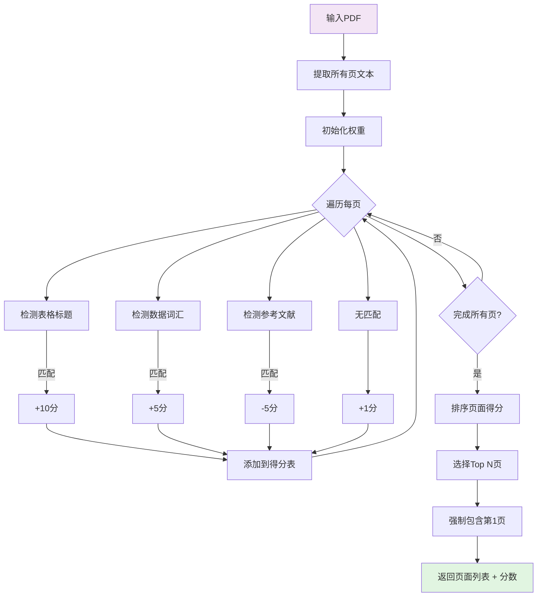

# Design Document

## Overview

本设计针对CFST数据提取系统的两大核心问题提供技术解决方案：

1. **Token溢出问题**：通过强化Prompt约束，强制AI模型输出极简JSON格式（reason字段为双引号或最多10个词）
2. **页面浪费问题**：实现智能页面筛选机制，仅处理最可能包含数据的页面

解决方案采用两阶段架构设计，在保留现有视觉处理流程的基础上，新增轻量级的文本侦察阶段，实现成本与精度的平衡。

## Steering Document Alignment

### Technical Standards
本设计遵循以下技术标准：
- **模块化设计**：智能筛选功能独立封装，与视觉处理模块解耦
- **配置驱动**：所有阈值、权重、关键词列表均通过config.json配置
- **向后兼容**：不修改现有处理流程，新增能力作为可选优化
- **错误隔离**：阶段一失败自动回退到阶段二，确保系统可用性

### Project Structure
设计遵循现有项目结构：
- `processing.py`：新增智能筛选函数（保持原有视觉处理逻辑不变）
- `config.json`：扩展配置项，包含评分权重、关键词列表等
- `main.py`：更新System Prompt（不改变核心工作流程）

## Code Reuse Analysis

### Existing Components to Leverage
- **`process_pdf()`函数**：现有视觉处理的主入口，扩展为支持选择性页面处理
- **`config.json`结构**：已有的嵌套配置结构，新增`page_filtering`配置段
- **`SYSTEM_PROMPT`**：现有系统提示词，增加JSON输出约束说明
- **OpenAI客户端**：已初始化的API客户端，接口无需修改

### Integration Points
- **`processing.py`入口**：新增`get_smart_pages_to_process()`函数，返回筛选后的页面列表
- **`config_manager.py`**：新增配置验证规则，确保评分权重合法
- **主处理流程**：在`process_pdf()`内增加阶段一（文本侦察），必要时跳过阶段二

## Architecture

### 两阶段处理流程图


### 智能页面筛选流程



### Modular Design Principles

**单文件职责**：
- `processing.py`：只负责PDF处理和页面筛选（规模约600行）
- `config_manager.py`：只负责配置验证（规模约200行）
- `main.py`：只负责流程编排和日志（保持现有规模）

**组件隔离**：
- 智能筛选功能独立成`get_smart_pages_to_process()`函数，可单独测试
- 评分算法独立成`score_page_content()`函数，便于调整权重
- 配置解析隔离，确保新增配置不会影响旧配置

**服务层分离**：
- 数据访问层：pdfplumber提取文本（阶段一）、pdf2image转换图片（阶段二）
- 业务逻辑层：页面评分算法、页面选择逻辑
- API调用层：OpenAI/Gemini视觉处理（与现有流程一致）

## Components and Interfaces

### Component 1: PDF Text Extraction (阶段一基础)

**Purpose**：使用pdfplumber快速提取PDF每页文本内容，用于评分

**Interfaces**：
```python
def extract_page_texts(pdf_path: str) -> Dict[int, str]:
    """
    提取PDF所有页面的文本内容

    参数：
        pdf_path: PDF文件路径

    返回：
        字典 {页码（从1开始）: 文本内容}

    异常：
        pdfplumber失败 -> 返回空字典，触发回退机制
    """
```

**Dependencies**：
- `pdfplumber`: 文本提取库
- `os`: 文件路径操作

**Reuses**：
- 现有的pdfplumber依赖（已在requirements.txt中）

### Component 2: Page Scoring Algorithm (核心评分逻辑)

**Purpose**：实现页面内容评分算法，识别高价值页面

**Interfaces**：
```python
def score_page_content(text: str, config: dict) -> int:
    """
    计算单页内容的评分

    参数：
        text: 页面文本内容
        config: 包含关键词权重的配置

    返回：
        整数得分（可能为负数）

    评分逻辑：
        - 表格标题匹配：+10分（可配置）
        - 数据词汇匹配：+5分（可配置）
        - 参考文献页：-5分（可配置）
        - 普通文本：+1分
    """

def get_smart_pages_to_process(pdf_path: str, config: dict) -> Tuple[List[int], str, List[Dict]]:
    """
    主函数：返回需要处理的页面列表

    参数：
        pdf_path: PDF文件路径
        config: 配置对象

    返回：
        Tuple包含：
        - 页面编号列表（从1开始）
        - 策略描述字符串（用于日志）
        - 调试信息列表（包含页面分数和选择原因）
    """
```

**Dependencies**：
- `re`: 正则表达式匹配
- `typing`: 类型注解

**Reuses**：
- config.json中定义的关键词列表
- 现有的日志系统记录页面选择逻辑

### Component 3: Prompt Optimization (JSON约束)

**Purpose**：优化SYSTEM_PROMPT，强制AI输出符合约束的JSON格式

**Interfaces**：
```python
# 在main.py中修改SYSTEM_PROMPT常量（完整版本）
SYSTEM_PROMPT = """
# Role

你是一个精通钢管混凝土（CFST）试验数据的结构工程专家助手。
你正在使用先进的计算机视觉能力分析学术论文的页面图像（Images of Paper Pages）。

# 0. Relevance & Validity Check (CRITICAL)

**CRITICAL STEP**: 在提取详细数据前，请综合文字和图像信息判断文档是否符合要求。
**符合要求的标准**（必须全部满足）：
\n1. **对象**: 必须是钢管混凝土 (CFST) 构件。
2. **内容**: 必须包含 **试验数据 (Experimental Data/Test Results)** 。
   - *Visual Hint*: 寻找包含 "Test", "Experimental" 标题的表格，或展示试件破坏模态（压溃、鼓曲）的**试验照片**。\n3. **构件类型**: 必须是柱 (Columns/Stub columns)。

**拒绝情况 (Rejection)**：

- 纯有限元模拟 (FEA only) 且无试验验证 -> **拒绝**。\n- 纯理论推导 (Analytical only) -> **拒绝**。\n- 梁 (Beams) 或 节点 (Joints) -> **拒绝**。\n
**如果不符合要求**：
输出一个空的 JSON 结构，status 标记为 false：
`{ "Group_A": [], "Group_B": [], "Group_C": [], "is_valid": false, "reason": "Not experimental CFST column paper" }`

# Task
分析输入的论文页面图像，提取CFST构件的试验数据。
**Core Strategy (Visual Processing)**:
\n1. 扫描所有图片，定位包含几何尺寸和试验结果的表格 (Tables)。\n2. 以 **Specimen Label (试件编号)** 为唯一索引（Primary Key）。\n3. 如果数据分散在不同表格（例如尺寸在 Table 1，承载力在 Table 2），请根据 Specimen Label 将它们合并。\n
# 1. Classification & Geometry Mapping Rules (Strict)
将构件分为三组，并严格执行几何参数映射：
* **Group_A (Square/Rectangular)**: 方形/矩形。
    - `b` = Width (宽度), `h` = Depth (深度).
* **Group_B (Circular)**: 圆形。
    - `b` = Diameter (直径 $D$), `h` = Diameter (直径 $D$). (Must satisfy `b == h`).
* **Group_C (Round_ended)**: 圆端形/椭圆形。
    - `b` = Major Axis (长轴), `h` = Minor Axis (短轴). (Must satisfy `b >= h`).

# 2. Data Extraction Dictionary (Precise Definitions)
请严格基于以下定义提取数据：

* **Basic Info**:
    - `ref_no`: Leave blank (Python will auto-fill filename).\n    - `specimen_label`: The unique ID/Label of the specimen.\n
* **Material Properties**:
    - `fc_value`: Concrete compressive strength **value** only (MPa).\n    - `fc_type`: Description (e.g., "Cube 150", "Cylinder 150x300"，"prism 150×150×300mm").示例中均为标准的立方体,圆柱体或棱柱体(轴心)抗压强度。若文中未说明规格，则只描述"cube"，"cylinder"，"prism"。\n    - `fy`: Yield strength of steel (MPa).\n    - `r_ratio`: Recycled aggregate ratio (%). Fill `0` if normal concrete.\n
* **Geometric Dimensions**:
    - `b` & `h`: See Section 1 rules (mm).\n    - `t`: Thickness of the steel tube (mm).\n    - `r0`: External corner/radius (mm). **Calculate strictly as follows**:\n        - For **Group_A**: Always fill `0`.\n        - For **Group_B**: Fill `h / 2` (i.e., Radius).\n        - For **Group_C**: Fill `h / 2` (Radius of the circular ends).\n    - `L`: Length of the specimen (mm).\n
* **Loading & Results**:
    - `e1`, `e2`: Eccentricity (mm).e1为上端偏心，e2为下端偏心,如果未明确定义上下端偏心，则默认e1=e2=文中的偏心e(eccentricity). Axial = 0.
    - `n_exp`: **Experimental** Ultimate Bearing Capacity ($N_{exp}$/Peak Load). Unit: kN. **Exclude** FEA/Calculated results.\n
* **Source Evidence (Visual Tracking)**:
- `source_evidence`: **必须提供数据来源的视觉定位**。\n- 格式： "Page [X], Table [Y]" 或 "Page [X] text section"。\n- 目的：方便人工回溯检查。\n* **Formatting**:
    - `fcy150`: Always leave as empty string `""`.\n    - Remove units from numeric fields.\n
# 3. OCR Correction (Visual Assistant)

由于你是通过视觉识别图片中的文字，请注意以下OCR纠错，但不要改变原始数据的含义：\n\n- 区分数字 `1` 和字母 `l/I`。\n- 区分数字 `0` 和字母 `O`。\n- 注意小数点 `.` 的位置（结合土木工程常识，例如 fc 不可能是 305 MPa）。\n
# 4. Output Format (JSON Only - STRICT RULES)
**CRITICAL OUTPUT REQUIREMENTS:**\n\n1. **PURE JSON ONLY**: Output ONLY a raw JSON string. DO NOT wrap in Markdown code blocks (```json ... ```). DO NOT add any explanatory text before or after the JSON.\n\n2. **reason FIELD CONSTRAINT**: The `reason` field MUST be either:\n   - An empty string: `""` (preferred for valid data)\n   - OR a brief explanation with MAXIMUM 10 words (e.g., "Not experimental CFST column paper")\n   - DO NOT write long explanations or paragraphs in the reason field\n\n3. **JSON Structure**:\n```json\n{\n  "is_valid": true/false,\n  "reason": "",\n  "Group_A": [ ... ],\n  "Group_B": [ ... ],\n  "Group_C": [ ... ]\n}\n```\n\n**EXAMPLES OF CORRECT OUTPUT:**\n✅ `{"is_valid": true, "reason": "", "Group_A": [{"ref_no": "", "specimen_label": "C-1", ...}]}`\n\n❌ WRONG: ```json{...}``` (Markdown wrapping)\n❌ WRONG: `{"is_valid": true, "reason": "The paper provides comprehensive experimental data..."}` (Too long)\n"""
```

**Dependencies**：
- `main.py`: 包含SYSTEM_PROMPT定义

**Reuses**：
- 现有的OpenAI客户端配置
- 现有的JSON解析逻辑（增加截断检测）

### Component 4: Configuration Schema Extension

**Purpose**：扩展config.json结构，支持页面筛选配置

**系统限制**：扫描的PDF页数至多30页（`absolute_max_pages: 30`），这是为了防止处理过大的PDF文件导致的性能问题。

**数据模型**：
```json
{
  "api_settings": {...},
  "processing_settings": {
    "short_paper_threshold": 10,  // ≤10页跳过筛选
    "max_scan_limit": 10,  // 回退策略时的最大页数
    "enable_smart_filtering": true,  // 新增：启用智能筛选
    "absolute_max_pages": 30,  // 扫描的PDF页数至多30页
    "page_filtering": {  // 新增评分配置
      "table_title_weight": 10,
      "data_keyword_weight": 5,
      "reference_weight": -5,
      "table_patterns": [
        "Table\\s+\\d+",
        "Tab\\.\\s+\\d+"
      ],
      "data_keywords": [
        "Specimen",
        "Experimental",
        "kN",
        "mm",
        "B/t",
        "D/t"
      ],
      "reference_patterns": [
        "References",
        "Bibliography",
        "REFERENCES"
      ],
      "max_selected_pages": 8,  // 筛选后最多选择8页
      "mandatory_include_first_page": true  // 强制包含第1页
    },
    "absolute_max_pages": 30  // 扫描的PDF页数至多30页
  },
  "paths": {...}
}
```

## Data Models

### Page Scoring Result
```python
@dataclass
class PageScore:
    """单页评分结果"""
    page_number: int      # 页码（从1开始）
    score: int            # 总得分
    matched_keywords: List[str]  # 匹配的关键词列表
    is_table_page: bool   # 是否包含表格
    is_reference: bool    # 是否为参考文献页
```

### Smart Filtering Config
```python
@dataclass
class PageFilteringConfig:
    """页面筛选配置"""
    enabled: bool = True  # 是否启用智能筛选
    table_title_weight: int = 10
    data_keyword_weight: int = 5
    reference_weight: int = -5
    max_selected_pages: int = 8  # 筛选后最多选择8页
    mandatory_include_first_page: bool = True  # 强制包含第1页
    table_patterns: List[str] = None
    data_keywords: List[str] = None
    reference_patterns: List[str] = None

    def __init__(self, **kwargs):
        # 设置默认值
        self.table_patterns = [
            r'Table\\s+\\d+',
            r'Tab\\.\\s+\\d+',
            r'表\\s+\\d+'
        ]
        self.data_keywords = [
            'Specimen', 'Experimental', 'kN', 'mm',
            'B/t', 'D/t', 'fc', 'fy', 'D', 't'
        ]
        self.reference_patterns = [
            r'References', r'Bibliography', r'REFERENCES', r'参考文献'
        ]

        # 从kwargs更新，但保留未指定的默认值
        for key, value in kwargs.items():
            if key in ['table_patterns', 'data_keywords', 'reference_patterns']:
                # 对于列表类型，合并而不是完全替换
                if isinstance(value, list):
                    existing = getattr(self, key)
                    existing.extend(value)
                    setattr(self, key, list(set(existing)))  # 去重
            else:
                setattr(self, key, value)
```

### Processing Debug Info
```python
@dataclass
class FilteringDebugInfo:
    """用于日志和调试的详细信息"""
    total_pages: int
    filtered_pages: List[int]
    page_scores: List[PageScore]
    strategy: str
    processing_time_ms: float
```

## Error Handling

### Error Scenario 1: pdfplumber提取失败

**描述**：pdfplumber失败或无法提取文本，阶段一无法完成

**处理方式**：
```python
try:
    page_texts = extract_page_texts(pdf_path)
    if not page_texts:  # 提取失败为空
        logger.warning(f"文本提取失败，回退到简单截断策略: {pdf_path}")
        return list(range(1, min(page_count, max_scan_limit) + 1)), "回退到截断策略", []
except Exception as e:
    logger.error(f"文本侦察阶段异常: {str(e)}")
    # 继续流程，但标记为回退状态
```

**用户影响**：
- 系统降级处理（性能影响可忽略）
- 日志中记录降级原因，无需用户干预

### Error Scenario 2: JSON解析失败（截断）

**描述**：AI返回的JSON因token溢出被截断，无法解析

**处理策略**：
```python
try:
    response = client.chat.completions.create(...)
    content = response.choices[0].message.content
    # 检测是否可能是截断的JSON
    if '\"Group_A\": [' in content and not content.rstrip().endswith('}'):
        logger.error(f"检测到截断JSON: {pdf_path}")
        # 移除包含Markdown代码块标记的错误内容
    result = json.loads(content)
except json.JSONDecodeError as e:
    logger.error(f"JSON解析失败: {str(e)}, 文件: {pdf_path}")
    # 移动到Manual_Review目录
    move_to_manual_review(pdf_path, f"JSON解析失败: {str(e)}")
    # 返回结果，继续批量处理
    return {"is_valid": False, "reason": "JSON Parsing Error"}
```

**日志记录**：
```
[ERROR] JSON解析失败 - file: paper_2024.pdf
错误详情: Unterminated string starting at: line 29 column 7
截断内容: {"is_valid": true, "reason": "The paper provides experimental data for eccentrically loaded...
操作: 文件已移动到 Manual_Review/paper_2024.pdf
```

**用户影响**：
- 打印红色错误消息
- 文件被移动到Manual_Review目录
- 批量处理继续，不影响其他文件

### Error Scenario 3: 关键词配置错误

**描述**：config.json中的关键词模式无效，导致匹配失败

**处理方式**：
```python
try:
    pattern = re.compile(keyword_pattern)
except re.error:
    logger.warning(f"无效的正则表达式模式: {keyword_pattern}, 跳过该模式")
    continue  # 跳过无效模式，其他模式继续匹配
```

**用户影响**：
- 部分功能降级（某些关键词失效）
- 日志中记录无效模式，便于调试
- 核心功能不受影响

### Error Scenario 4: 页面筛选为空

**描述**：所有页面得分均为负数，筛选后无页面可选

**处理策略**：
```python
filtered_pages = [page for page, score in scored_pages if score > 0]
if not filtered_pages:
    logger.warning(f"筛选后无有效页面，回退到默认页: {pdf_path}")
    # 选择得分最高的页面（即使为负），确保至少处理1页
    filtered_pages = [scored_pages[0][0]]  # 加第一页
```

**用户影响**：
- 处理效率降低（可能处理低价值页面）
- 日志记录回退逻辑，提醒检查关键词配置

## Testing Strategy

### 单元测试

**页面评分算法测试**：
```python
def test_score_page_with_table():
    text = "Table 1 shows experimental results for Specimen C-1"
    score = score_page_content(text, DEFAULT_CONFIG)
    assert score >= 15  # Table (+10) + Specimen (+5)

def test_score_reference_page():
    text = "References: [1] Smith et al. (2020)"
    score = score_page_content(text, DEFAULT_CONFIG)
    assert score == -4  # Reference (-5) + Base (+1)

def test_score_empty_page():
    text = ""
    score = score_page_content(text, DEFAULT_CONFIG)
    assert score == 0  # No content = No score
```

**页面选择逻辑测试**：
```python
def test_select_top_pages():
    scores = [(1, 20), (2, 5), (3, 15), (4, 25), (5, 10)]
    selected = select_top_pages(scores, max_pages=3, include_first=True)
    assert selected == [1, 4, 3]  # 第1页强制包含，然后选4和3

def test_empty_scores_fallback():
    scores = []
    selected = select_top_pages(scores, max_pages=5)
    assert selected == []  # 空列表，触发回退逻辑
```

### 集成测试

**两阶段处理完整流程**：
```python
def test_two_phase_processing():
    # 准备测试PDF（20页，包含表格在第5、12、18页）
    pdf_path = "test_long_paper.pdf"
    config = load_config_with_smart_filtering()

    # 执行两阶段处理
    pages, description, debug_info = get_smart_pages_to_process(pdf_path, config)

    # 验证结果
    assert len(pages) <= 8  # 不超过最大限制
    assert 1 in pages  # 第1页强制包含
    assert 5 in pages or 12 in pages or 18 in pages  # 至少选中一个含表格页
```

**JSON约束效果测试**：
```python
def test_json_reason_field_constraint():
    system_prompt = generate_system_prompt_with_constraints()

    # 测试有效响应
    valid_response = '{"is_valid": true, "reason": "", "Group_A": []}'
    result = parse_ai_response(valid_response)
    assert result.is_valid == True

    # 测试无效响应（reason过长）
    long_reason = 'A' * 100  # 100个字符
    invalid_response = f'{{"is_valid": true, "reason": "{long_reason}"}}'
    result = parse_ai_response(invalid_response)
    assert result.reason_length <= 10  # 被截断或记录警告
```

### 端到端测试

**典型长论文场景**：
- 测试PDF：30页，试验数据在第5-8页（表格），第20页（结果）
- 预期选择：第1、5、6、7、8、20页（约6页）
- 成本节省：从10页减少到6页（40%节省）
- 成功率：所有试验数据都应被提取

**异常场景测试**：
1. 使用失效的pdfplumber（模拟提取失败），验证回退策略
2. 使用无效关键词配置（模拟正则错误），验证部分降级
3. 使用被截断的AI响应，验证JSON解析错误处理

**性能基准测试**：
- 100页PDF的文本侦察时间应<200ms
- 批量处理10个PDF（平均20页）的总时间影响<5%

### 回归测试

- 短论文（≤10页）必须保持全量扫描行为
- 现有Excel数据格式必须保持不变
- 零数据检测（空Group_A/B/C）逻辑不得被破坏
